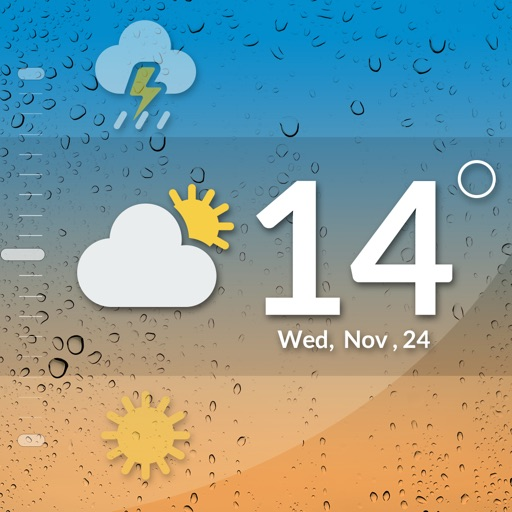

# 19_NYC_Weather_Forecast_Machine_Learning_Project 

In this assignment, we are using machine learning to predict the weather forecasts for New York City. 

## Data Source(s)
https://www.ncdc.noaa.gov/cdo-web/

## Methods
We used 2 separate models: ARIMA (Auto Regressive Moving Average) & LSTM (Long Short-Term Memory). The same dataset was split in this manner:
*  80% Train data,
*  20% Test data.

A Python notebook contains the totality of our procedure.

A tableau workbook was created to creating our reports and our final presentation and analysis.

## Participants
* Anna Wrobel
* Latyr Thiao
* Leah Lindy
* Lujane Abdelgadir
* Prajakta Kalvankar
* Stephen Zhang

## Results

https://public.tableau.com/profile/latyr#!/vizhome/Combined_Weather_15999108337820/Presentation

